<h1 align="center"> ClassManager </h1>

  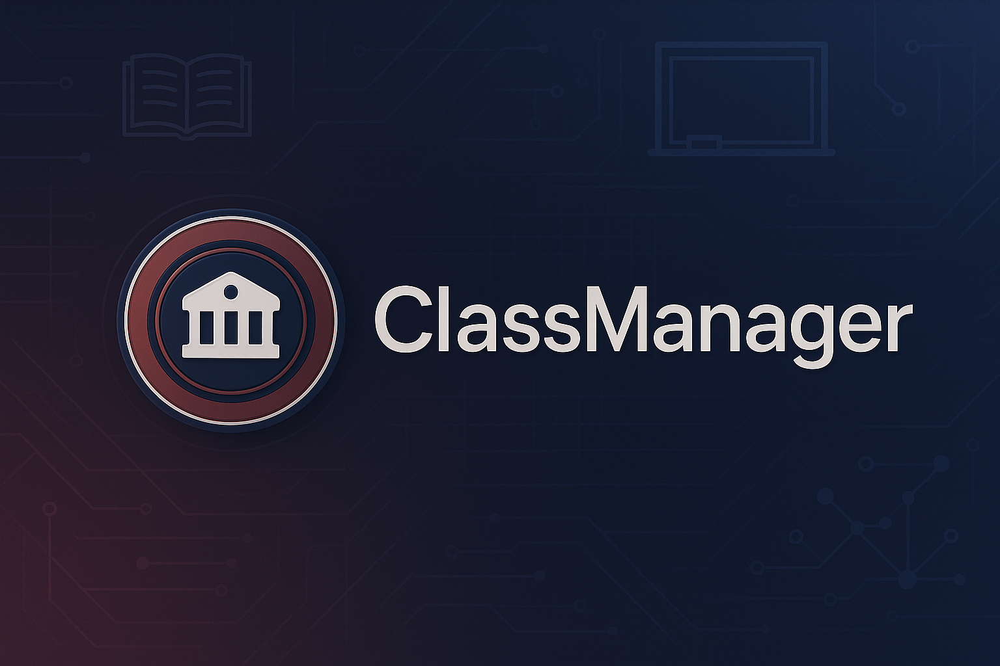

---

## 📚 Sumário

### [📌 Sobre o projeto](#sobre)
### [🧰 Tecnologias Utilizadas](#TecnologiasUtilizadas)
### [💻 Como utilizar o ClassManager](#ComoRodar)
### [📷 Imagens do sistema](#ImagensDoSistema)
### [📞 Contato e Créditos](#CreditosEContato)

## 📌 Sobre o projeto

### O ClassManager é um sistema de gestão acadêmica, desenvolvido como parte do projeto Framework II da faculdade. Ele permite cadastrar e gerenciar disciplinas, professores e aulas, oferecendo uma interface moderna e intuitiva para controle escolar.

### 🧩 O projeto segue a arquitetura Full Stack, com o back-end desenvolvido em Node.js (utilizando Express, Sequelize, JWT e Swagger) e o front-end em Next.js com React e TailwindCSS. O banco de dados utilizado é o MySQL, configurado via Docker Compose para facilitar a implantação e portabilidade do sistema.

### 💡 O objetivo principal foi aplicar conceitos avançados de desenvolvimento web, integração entre front e back, autenticação com JWT e documentação de API. Além disso, foi implementado um pipeline automatizado com GitHub Actions para publicação das imagens no Docker Hub.

###  A estrutura do projeto foi pensada para ser modular, organizada e escalável — com separação clara entre rotas, controladores, modelos e middlewares, garantindo facilidade de manutenção e entendimento do código.

## 🧰 Tecnologias Utilizadas

### ⚙️ **Back-End**

  

Ambiente de execução JavaScript responsável por toda a lógica do servidor e integração entre as partes do sistema.

  

Framework web usado para criar as rotas da API, middlewares e gerenciar as requisições HTTP.

  

Implementa autenticação baseada em tokens, garantindo segurança no acesso às rotas da API.

  

Ferramenta de documentação que permite testar e visualizar as rotas da API de forma prática e interativa.

---

### 🗄️ **Banco de Dados**

  

ORM que facilita a comunicação entre o back-end e o banco de dados, simplificando a criação de tabelas e operações CRUD.

  

Banco de dados relacional utilizado para armazenar todas as informações do sistema, como professores, disciplinas e aulas.

---

### 🖥️ **Front-End**

  

Framework React que estrutura o front-end, trazendo desempenho, roteamento otimizado e renderização moderna.

  

Biblioteca JavaScript usada na construção de componentes reutilizáveis e responsivos para a interface do usuário.

  

Framework CSS que simplifica a estilização com classes utilitárias, garantindo um design limpo e responsivo.

---

### ☁️ **Infraestrutura e DevOps**

  

Utilizado para containerizar o projeto, permitindo rodar o banco de dados, API e front-end de forma integrada e portátil.

  

Ferramenta de automação CI/CD que realiza o build e publica as imagens do projeto automaticamente no Docker Hub.

## 💻 Como rodar o programa 

✅ 1. Baixe o arquivo docker-compose.yml e o arquivo de exemplo de variáveis .env.example neste repositório.

✅ 2. Renomeie o arquivo .env.example para .env
Preencha as variáveis conforme suas preferências.

✅ 3. Certifique-se de ter o Docker instalado na sua máquina.
 [Link para o site do docker](https://www.docker.com/products/docker-desktop/)

✅ 4. Na pasta onde baixou os dois arquivos (docker-compose.yml e .env.example), execute:
 docker compose up

✅ 5. Aguarde a inicialização dos containers. Após subir:
- Front-end: http://localhost:3000
- API com Swagger: http://localhost:3001/api-docs
- Painel MySQL (opcional): http://localhost:8081

✅ 6. Pronto para usar
Crie usuários, faça login e cadastre disciplinas, professores e aulas pela interface.

## 📷 Imagens do sistema

<table>
  <tr>
    <td align="center"><strong>início</strong></td>
    <td align="center"><strong>Login</strong></td>
  </tr>
  <tr>
    <td>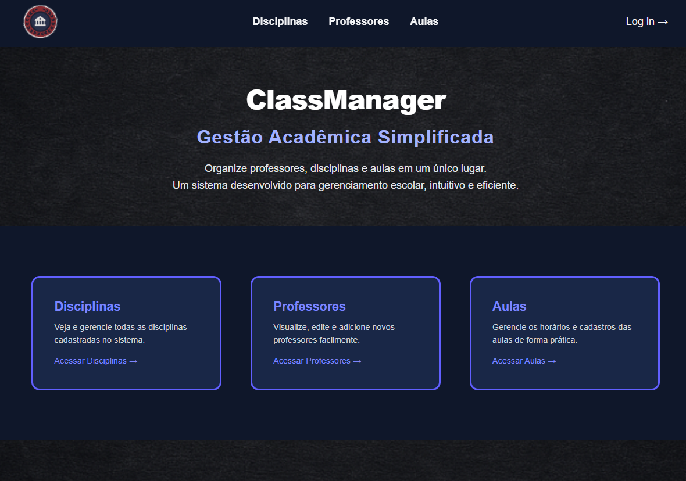</td>
    <td>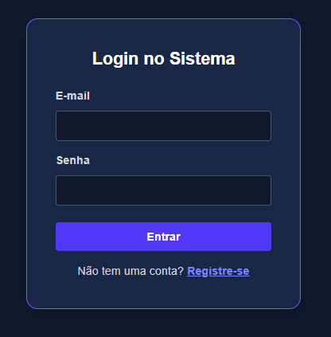</td>
  </tr>
  <tr>
    <td align="center"><strong>Cabeçalho Logado</strong></td>
    <td align="center"><strong>Cabeçalho Login</strong></td>
  </tr>
  <tr>
    <td> 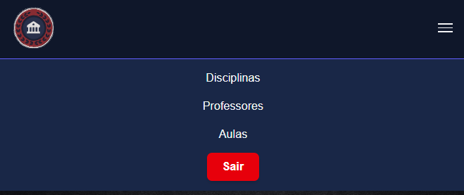</td>
    <td> 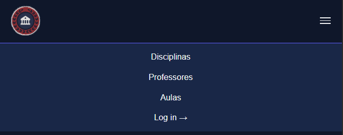</td>
  </tr>
  </tr>
    <tr>
    <td align="center"><strong>Rodapé</strong></td>
    <td align="center"><strong>CRUD</strong></td>
  </tr>
  <tr>
    <td>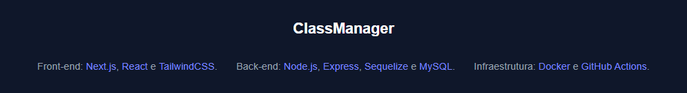</td>
    <td>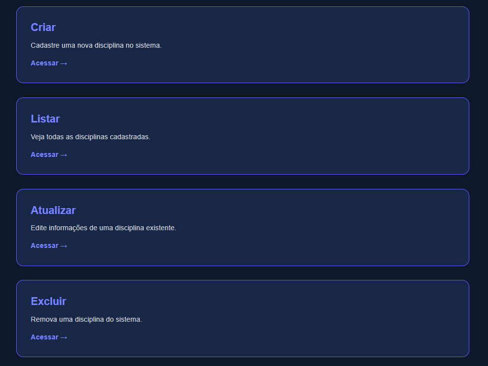</td>
  </tr>
  <tr>
    <td align="center"><strong>Criar</strong></td>
    <td align="center"><strong>Listar</strong></td>
  </tr>
  <tr>
    <td>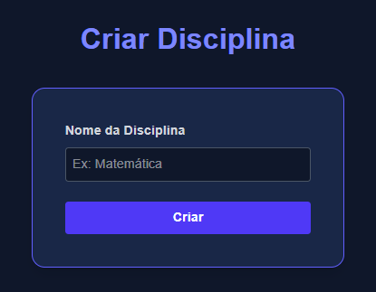</td>
    <td>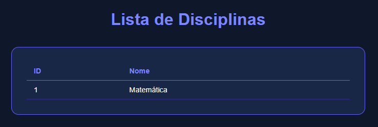</td>
  </tr>
  <tr>
    <td align="center"><strong>Deletar</strong></td>
    <td align="center"><strong>Atualizar</strong></td>
  </tr>
  <tr>
    <td>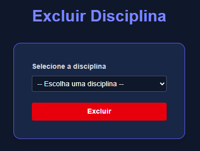</td>
    <td>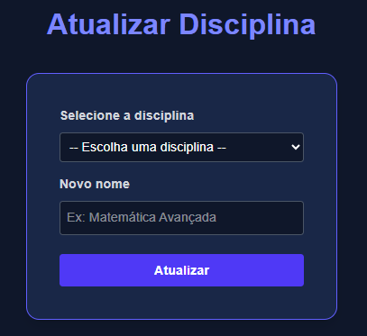</td>
  </tr>
</table>

## 📞 Créditos e Contato

<h3> Desenvolvido por <a href= https://rincon23.github.io/>Enzo Rincon</a></h3> 

📍 Localização: São Paulo 

💼 Áreas de interesse: Desenvolvimento Fullstack.

📢 Aberto a oportunidades profissionais na área de desenvolvimento

---

### 📬 Como entrar em contato?

Curtiu o projeto? Quer dar um feedback, trocar ideia sobre tecnologia ou até falar de vagas?

Tô sempre aberto a conversar! É só me chamar nos links aí embaixo 👇

<table> 
    <tr>
        <td><strong>📧 E-mail:</strong></td> 
        <td><a href="mailto:enzorincon2003@gmail.com">enzorincon2003@gmail.com</a></td> 
    </tr>
    <tr> 
        <td><strong>💼 LinkedIn:</strong></td> 
        <td><a href="https://www.linkedin.com/in/enzorincon">linkedin.com/in/enzorincon</a></td> 
    </tr> 
    <tr> 
        <td><strong>📷 Instagram:</strong></td> 
        <td><a href="https://www.instagram.com/enzo.rincon">@enzo.rincon</a></td> 
    </tr> 
    <tr> 
        <td><strong>🌐 Portifólio:</strong></td> 
        <td><a href="https://rincon23.github.io/">https://rincon23.github.io/</a></td> 
    </tr> 

</table>

---

⭐ Obrigado por visitar este projeto! ⭐
